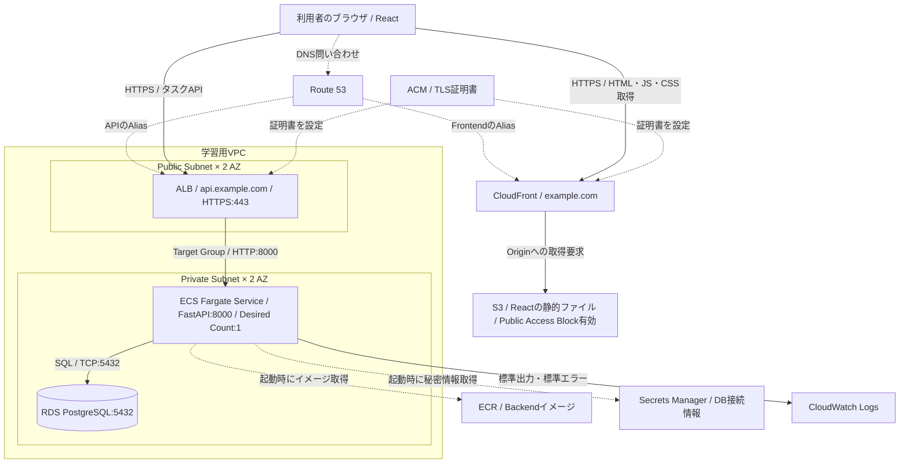
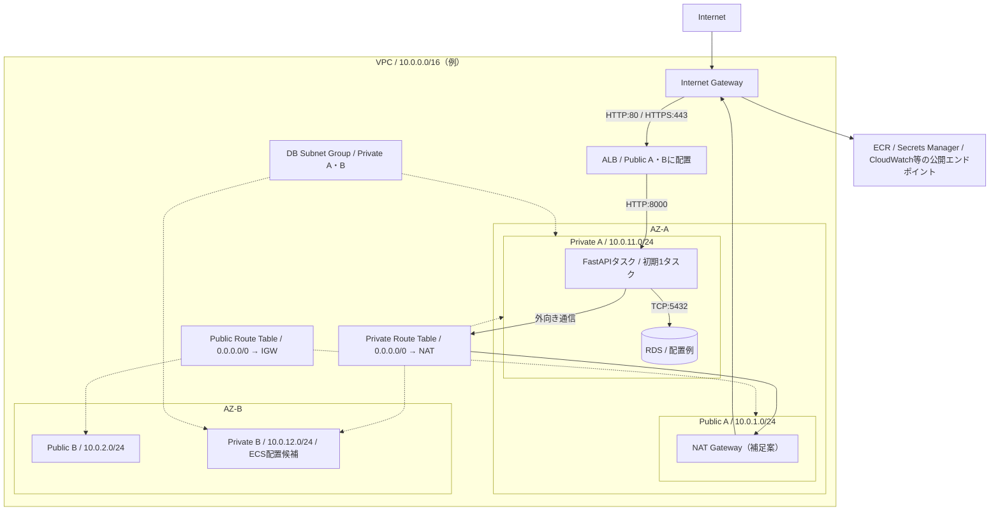
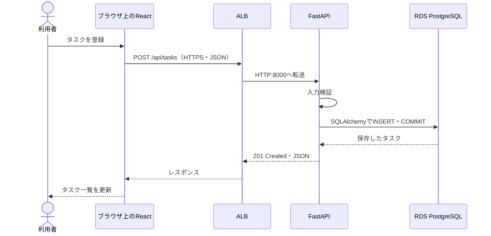
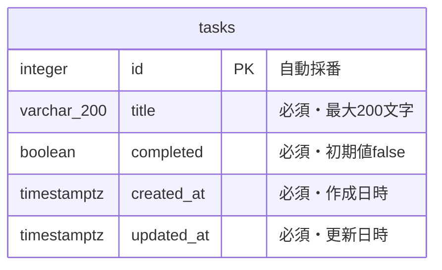
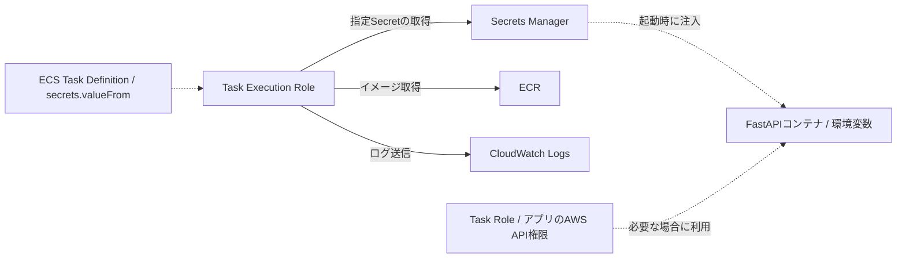
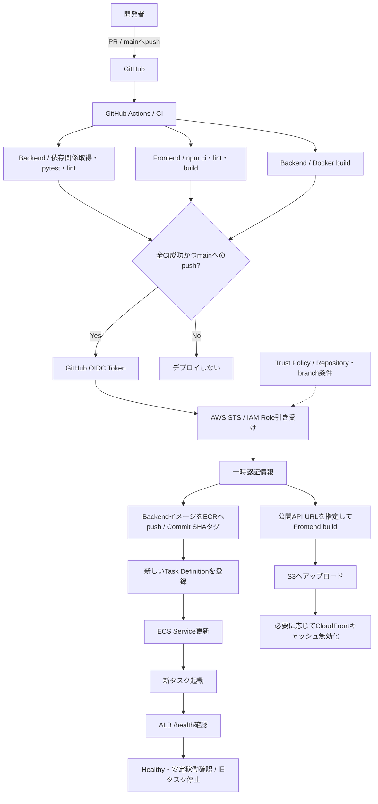
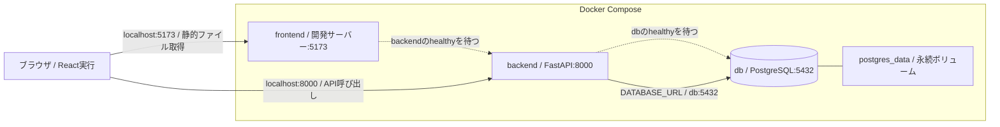
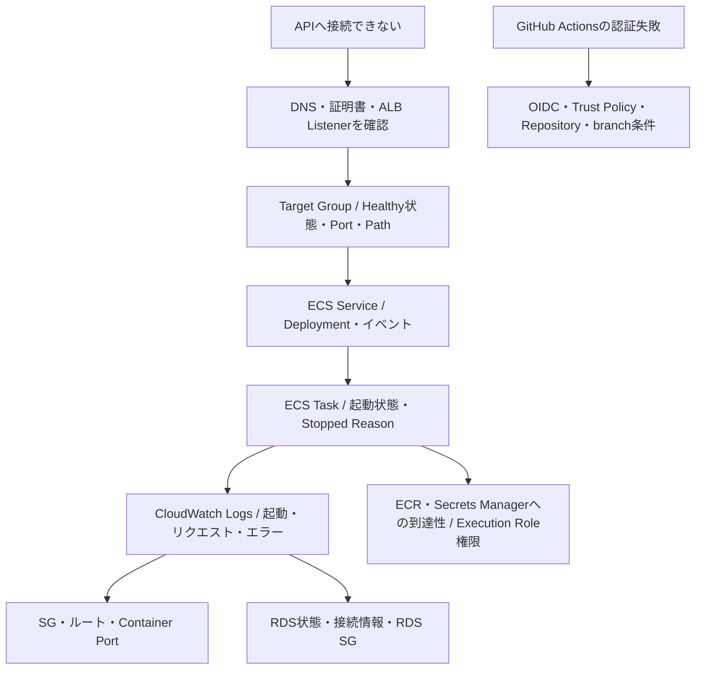
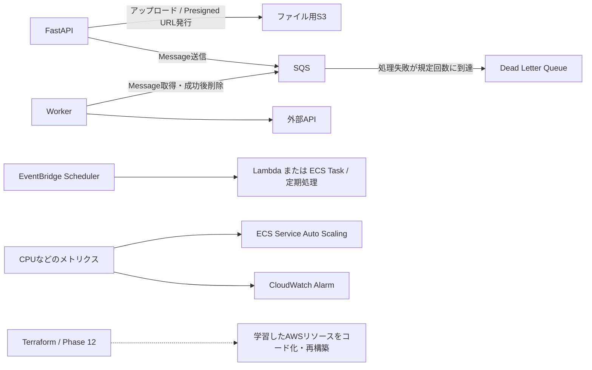

# タスク管理アプリ システム設計図

## 1. 設計の対象と前提

[学習TODO](aws_webapp_cicd_learning_todo.md)をもとに、Phase 0〜10の完成時点を目標とする構成を示す。Phase 11の発展課題とPhase 12のTerraform化は末尾に分けて記載する。

ローカル構成・API・データモデルは、現在の `compose.yaml`、`backend/main.py`、Alembicの定義も参照した。AWS構成とCI/CDは目標設計であり、構築済みを意味しない。

| 項目 | 設計 |
|---|---|
| アプリ | タスクの一覧・登録・更新・削除・完了切り替え |
| Frontend | React。AWSではビルド済み静的ファイルをS3からCloudFront経由で配信 |
| Backend | FastAPI + SQLAlchemy。ECS Fargateで実行、コンテナポート8000 |
| Database | RDS PostgreSQL。Private Subnetに配置、Public Access無効 |
| 公開URL例 | Frontend: `https://example.com`、API: `https://api.example.com` |
| 初期稼働数 | ECS ServiceのDesired Countは1。2つのAZを配置候補にする |
| 秘密情報・ログ | Secrets Manager、CloudWatch Logs |
| 自動化 | GitHub ActionsでCI/CD、OIDCでAWS認証 |

## 2. AWS全体構成

実線はリクエストやデータの流れ、点線はDNS設定・証明書・起動時参照などの補助関係を表す。Route 53は名前解決を担当し、HTTP通信を中継しない。Reactは利用者のブラウザで動作する。

設計補足として、S3への読み取りはCloudFrontのOACとバケットポリシーで許可する。Frontendのビルド時に `VITE_API_URL=https://api.example.com` を設定し、Backendの `CORS_ORIGINS` には `https://example.com` を設定する。

## 3. ネットワークとアクセス制御

以下のCIDRとNAT GatewayはTODOで未指定のため、設計例として補った。Private Subnetのタスクがイメージ取得・秘密情報取得・ログ送信を行えるよう、外向きの経路を用意する。

- VPC内のALB → ECS → RDS通信はVPC内の経路を使い、NATを経由しない。
- NAT Gatewayは学習用に1台を置く案。AZ単位の可用性は保証しない。VPC Endpointを使う構成への変更も検討対象とする。
- DB Subnet Groupに2つのAZを含めることと、RDSのMulti-AZ配置を有効にすることは別。RDSの冗長化はTODOで未指定。
- ALBが2つのAZを使っていても、初期のECSタスク数1ではアプリの冗長化はされない。

| Security Group | インバウンド許可元 | ポート・用途 |
|---|---|---|
| ALB SG | Internet | TCP 80・443。完成時は80から443へリダイレクト |
| ECS SG | ALB SGのみ | TCP 8000。API・ヘルスチェック |
| RDS SG | ECS SGのみ | TCP 5432。DB接続 |

アウトバウンドはALBからECSの8000、ECSからRDSの5432、および起動・ログ送信に必要なHTTPS通信を許可する。

## 4. API処理とデータ設計

| Method | Path | 用途 |
|---|---|---|
| GET | `/health` | ALBヘルスチェック |
| GET | `/api/tasks` | 一覧取得 |
| POST | `/api/tasks` | 登録 |
| PATCH | `/api/tasks/{task_id}` | タイトル・完了状態の更新 |
| DELETE | `/api/tasks/{task_id}` | 削除 |

スキーマ変更はAlembicで管理する。現在の `/health` はアプリの応答を確認するもので、DB疎通は確認しない。認証・ユーザー別タスク管理はTODOの基本構成に含まれていない。

## 5. 秘密情報とIAM

TODOではDB Host・Port・Name・User・Passwordを保存する。一方、現在のBackendは `DATABASE_URL` を読み取るため、AWS化時には接続URLをSecretとして追加して注入するか、各項目から接続URLを組み立てる実装が必要。秘密情報をFrontendの環境変数へ入れない。

Task Execution Roleには起動・ログ転送に必要な権限を付与し、Secret参照先を限定する。Task Roleはアプリ自身がAWS APIを呼ぶための権限であり、将来のS3・SQS連携などで利用する。

## 6. CI/CD

CIはPull Requestとmainへのpushで実行する。CDはmainへのpushに対するCI成功後に実行する設計とする。

GitHub Actionsには `id-token: write` と `contents: read` を設定し、長期Access Keyを保存しない。デプロイ用Roleの権限は対象ECR・ECS・S3・CloudFrontと、必要なRoleへのPassRoleに絞る。

DBマイグレーションの実行タイミングはTODOで未指定。現在はBackend起動時に実行する構成のため、CDで複数タスクが同時起動する段階では、一度だけ実行する方式とスキーマ互換性を検討する。

## 7. ローカル開発構成

## 8. 障害調査の流れ

## 9. 発展課題とTerraform化

以下は基本構成の完成後に追加する構成。Workerの実行基盤など、TODOで未指定の項目は実装時に決定する。

Terraform化はConsole / CLIで手動構築を理解した後に行う。再構築後はGitHub Actionsによるデプロイとブラウザからの動作確認までを完了条件とする。
